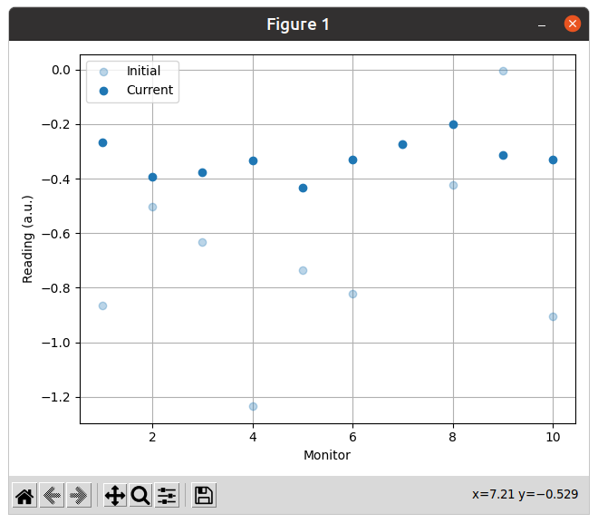

# User Guide

The COI utilities are very modular. Each one is an independent package under
the namespace `cernml`.

```python
from cernml import japc_utils, gym_utils
```

## Managing PyJapc Subscriptions

[Usage examples](#introducing-parameter-streams) of {mod}`~cernml.japc_utils`'s
parameter streams follow a bit further below. This section begins by motivating
their creation.

### Motivation

Imagine the following, trivial optimization problem. It talks to two imaginary
devices via {class}`~pyjapc:pyjapc.PyJapc`. We're deliberately ignoring all
sorts of complicating factors, like normalization, configuration or other
transformations:

```{code-block} python
from cernml import coi
from gym.spaces import Box
from pyjapc import PyJapc

class ExampleEnv(coi.SingleOptimizable):
    metadata = {
        'cern.machine': coi.Machine.SPS,
        'cern.japc': True,
    }

    optimization_space = Box(-1.0, 1.0, shape=())

    def __init__(self, japc=None):
        if japc is None:
            japc = PyJapc('SPS.USER.ALL')
        self.japc = japc

    def get_initial_params(self):
        return self.japc.getParam("SOME.DIPOLE/Settings")

    def compute_single_objective(self, params):
        self.japc.setParam("SOME.DIPOLE/Settings", params)
        return self.japc.getParam("SOME.MONITOR/Acquisition")
```

This code is (hopefully!) simple enough to understand. However, GET requests
via JAPC are often considered expensive. In most cases, you actually want
to use a SUBSCRIBE request instead. This would look somewhat like this:


```{code-block} python
---
emphasize-lines: 17-22,24-25,28,35-38
---
from cernml import coi
from gym.spaces import Box
from pyjapc import PyJapc

class ExampleEnv(coi.SingleOptimizable):
    metadata = {
        'cern.machine': coi.Machine.SPS,
        'cern.japc': True,
    }

    optimization_space = Box(-1.0, 1.0, shape=())

    def __init__(self, japc=None):
        if japc is None:
            japc = PyJapc('SPS.USER.ALL')
        self.japc = japc
        self.handle = japc.subscribeParam(
            "SOME.MONITOR/Acquisition",
            self._handle_value,
        )
        self.handle.startMonitoring()
        self.latest_value = None  # See 1.

    def _handle_value(self, name, value):  # See 2.
        self.last_value = value

    def close(self):
        self.handle.stopMonitoring()  # See 3.

    def get_initial_params(self):
        return self.japc.getParam("SOME.DIPOLE/Settings")

    def compute_single_objective(self, params):
        self.japc.setParam("SOME.DIPOLE/Settings", params)
        self.latest_value = None # See 4.
        while self.latest_value is None:
            time.sleep(1)  # See 5.
        return self.latest_value.copy()
```

This code already is somewhat more complicated than before. It also has a
number of problems:
1. We have to manually keep track of a variable that holds the latest acquired
   value.
2. We have to supply our own subscription handler. This code is usually always
   the same and tedius to write. If we want to handle errors, we have to supply
   an additional error handler. This error handler cannot throw exceptions
   (since it is invoked on another thread), so we must find another way to
   propagate the error.
3. We have to start and stop monitoring the subscription manually. The solution
   presented here actually cannot help with this: it is required by the way
   optimization problems are used by the host application.
4. We have to do some tricky synchronization with the subscription handler. We
   first invalidate the holding variable we defined in #1. Then we spin in a
   loop until the subscription handler sets it to a new value. Much like #2,
   this is repetitive and hides the actual logic of our problem.
5. The waiting time of one second is completely arbitrary. It may be far too
   short (if we wait for an SPS supercycle to pass) or far too long (if we
   subscribe to a parameter on a non-multiplexed device).

### Synchronization

For now, let us only focus on the last problem: Figuring out how long exactly
to wait. Luckily, the Python standard library module {mod}`threading` provides
multiple primitives for cross-thread synchronization. In our case, we want to
wait on thread A for a condition to become true, and signal such from thread B.
For this, we can use a {class}`~threading.Condition` variable:

```{code-block} python
---
emphasize-lines: 1,24,28-30,40-43
---
from threading import Condition

from cernml import coi
from gym.spaces import Box
from pyjapc import PyJapc

class ExampleEnv(coi.SingleOptimizable):
    metadata = {
        'cern.machine': coi.Machine.SPS,
        'cern.japc': True,
    }

    optimization_space = Box(-1.0, 1.0, shape=())

    def __init__(self, japc=None):
        if japc is None:
            japc = PyJapc('SPS.USER.ALL')
        self.japc = japc
        self.handle = japc.subscribeParam(
            "SOME.MONITOR/Acquisition",
            self._handle_value,
        )
        self.handle.startMonitoring()
        self.condition = Condition()
        self.latest_value = None

    def _handle_value(self, name, value):
        with self.condition:  # See 1.
            self.last_value = value
            self.condition.notify()

    def close(self):
        self.handle.stopMonitoring()

    def get_initial_params(self):
        return self.japc.getParam("SOME.DIPOLE/Settings")

    def compute_single_objective(self, params):
        self.japc.setParam("SOME.DIPOLE/Settings", params)
        with self.condition:  # See 2.
            self.latest_value = None
            self.condition.wait_for(lambda: self.latest_value is not None)
            return self.latest_value.copy()
```

Once again, the code has become more complicated with logic that only hides the
problem we want to express.

1. Whenever we receive a new value, we lock the condition variable. This
   ensures that our write to `last_value` doesn't interleave with the read from
   it inside `compute_single_objective()` in any strange way.
2. To receive a new value, we invalidate the old one (as before), and then
   *wait* until a new value is there. In contrast to `time.sleep`, this uses
   operating system functionality to wait exactly until the `notify()` call has
   passed.

### Introducing Parameter Streams

The {mod}`~cernml.japc_utils` module provides *parameter streams*: Objects that
wrap around all the code we had to write manually:
- They wrap around a subscription handle and expose methods to start and stop
  monitoring it.
- They contain a queue of received values so that you never miss any. By
  default, the queue has a maximum length of one. This is identical to our
  holder variable `latest_value`.
- They manage a condition variable in order to synchronize with the
  subscription handler.
- *In addition*, yhey install an error handler: Any JAPC error is caught and
  raises a Python exception when you attempt to read the next value.

Here is how much they simplify your code:

```{code-block} python
---
emphasize-lines: 1,17-19,24,31-32
---
from cernml import coi, japc_utils
from gym.spaces import Box
from pyjapc import PyJapc

class ExampleEnv(coi.SingleOptimizable):
    metadata = {
        'cern.machine': coi.Machine.SPS,
        'cern.japc': True,
    }

    optimization_space = Box(-1.0, 1.0, shape=())

    def __init__(self, japc=None):
        if japc is None:
            japc = PyJapc('SPS.USER.ALL')
        self.japc = japc
        self.stream = japc_utils.subscribe_stream(  # See 1.
            japc,
            "SOME.MONITOR/Acquisition",
        )
        self.stream.start_monitoring()  # See 2.

    def close(self):
        self.handle.stop_monitoring()

    def get_initial_params(self):
        return self.japc.getParam("SOME.DIPOLE/Settings")

    def compute_single_objective(self, params):
        self.japc.setParam("SOME.DIPOLE/Settings", params)
        value, header = self.stream.wait_for_next()  # See 3. and 4.
        return value
```

1. The {func}`~cernml.japc_utils.subscribe_stream()` call closely mirrors
   {meth}`~pyjapc:pyjapc.PyJapc.subscribeParam()`, but does not require
   callback functions.
2. We still need to start and stop monitoring. In constrast to to PyJapc,
   parameter streams use `snake_case`-style method names.
3. A single call to {meth}`~cernml.japc_utils.ParamStream.wait_for_next()`
   invalidates the queue, synchronizes with the subscription handler and waits
   for the next acquisition to arrive. Note that parameter streams always
   return the JAPC header.
4. The `header` variable is an object of type
   {class}`~cernml.japc_utils.Header`. It is mostly a regular dictionary (which
   you would get from raw subscriptions with `getHeader=True`), but also
   exposes its most common keys as attributes.

There are also methods to support other workflows, such as
{meth}`~cernml.japc_utils.ParamStream.pop_or_wait()`,
{meth}`~cernml.japc_utils.ParamStream.pop_if_ready()` and
{meth}`~cernml.japc_utils.ParamStream.clear()`:

```{code-block} python
from matplotlib.figure
from cernml.japc_utils import subscribe_stream

def process_data(japc):
    stream = subscribe_stream(
        japc,
        "SOME.DEVICE/Property#field",
        maxlen=None,  # Use an unbounded queue.
    )
    while True:
        value, header = stream.pop_or_wait()
        update_plots(value, header.cycle_stamp)
```

### Cancellation Integration

Let's extend our previous optimization problem a little. Assume that the device
may have intermitted failures. Maybe it works most of the time, but
occasionally returns data that is all-zeros. Or maybe it monitors an
accelerator that may unexpectedly lose its beam for several cycles. Parameter
streams make it easy to handle this case:

```{code-block} python
from logging import getLogger

LOG = getLogger(__name__)

class ExampleEnv(coi.SingleOptimizable):

    # Rest is the same as before ...

    def compute_single_objective(self, params):
        self.japc.setParam("SOME.DIPOLE/Settings", params)
        while True:
            value, header = self.stream.wait_for_next()
            if value == 0.0:
                LOG.warning("bad value from SOME.MONITOR")
                continue
            return value
```

However, one problem remains: This implementation of
`compute_single_objective()` will not return for as long as the device failure
persists. If this is a long time, the host application never regains control
and its user has no possibility to interrupt and cancel the operation.

This is the problem that cooperative
{mod}`~coi:cernml.coi.unstable.cancellation` aims to solve. We can request a
cancellation token from the host application and use it to check whether the
user has cancelled our optimization. Parameter streams have full support for
cancellation tokens:

```{code-block} python
---
emphasize-lines: 5,10,14-16,20,32-36
---
class ExampleEnv(coi.SingleOptimizable):
    metadata = {
        'cern.machine': coi.Machine.SPS,
        'cern.japc': True,
        'cern.cancellable': True,  # See 1.
    }

    optimization_space = Box(-1.0, 1.0, shape=())

    def __init__(self, japc=None, cancellation_token=None):
        if japc is None:
            japc = PyJapc('SPS.USER.ALL')
        self.japc = japc
        if cancellation_token is None:
            cancellation_token = coi.cancellation.Token()
        self.token = cancellation_token
        self.stream = japc_utils.subscribe_stream(
            japc,
            "SOME.MONITOR/Acquisition",
            token=cancellation_token,  # See 2.
        )
        self.stream.start_monitoring()

    def close(self):
        self.handle.stop_monitoring()

    def get_initial_params(self):
        return self.japc.getParam("SOME.DIPOLE/Settings")

    def compute_single_objective(self, params):
        self.japc.setParam("SOME.DIPOLE/Settings", params)
        try:
            value, header = self.stream.wait_for_next()  # See 3.
        except coi.cancellation.CancelledError:
            self.token.complete_cancellation()  # See 4.
            raise
        return value
```

Some notes as usual:
1. By adding {attr}`'cern.cancellable' <coi:cernml.coi.Problem.metadata>` to
   our metadata, we signal to the host application that we would like to
   receive a cancellation token.
2. The only thing that is *strictly* necessary is that you pass the
   cancellation token to {func}`~cernml.japc_utils.subscribe_stream()`.
   Everything else is handled for us from here.
3. If (and only if) you have given a token to the stream, it will wait on
   *both* a new acquisition or a cancellation. If the former happens, we
   receive the new value and return. If the latter happens, the usual
   {exc}`~coi:cernml.coi.unstable.cancellation.CancelledError` is raised.
4. Since cancellation is *cooperative*, we should cooperate with our host. By
   calling
   {meth}`~coi:cernml.coi.unstable.cancellation.Token.complete_cancellation()`,
   we let it know that we understood the request and brought ourselves into a
   clean state. This way, the host can reuse our object – for example to reset
   `SOME.DIPOLE` back to its original state.

### Context Managers

You can monitor parameter streams not only manually (as usual), but they are
also compatible with {keyword}`with` statements:

```{code-block} python
stream = japc_utils.subscribe_stream(japc, "SOME.MONITOR/Acquisition")
with stream:
    # stream.start_monitoring() is called here.
    value, header = stream.pop_or_wait()
# stream.stop_monitoring() is called here.
```

Here, {meth}`~cernml.japc_utils.ParamStream.start_monitoring()` is called upon
entry into the block and
{meth}`~cernml.japc_utils.ParamStream.stop_monitoring()` is called upon exit.
The advantage of {keyword}`with` statements is that the exit handler is called
even if the block is exited through an exception.

The package also provides two context managers –
{func}`~cernml.japc_utils.subscriptions()` and
{func}`~cernml.japc_utils.monitoring()` – to handle raw
{class}`~pyjapc:pyjapc.PyJapc`. objects and subscription handles respectively
in an analogous manner:

```{code-block} python
with japc_utils.subscriptions(japc):
    # japc.startSubscriptions() is called here.
    ...
# japc.stopSubscriptions() is called here.

handle = japc.subscribeParam("SOME.MONITOR/Acquisition", print)
with japc_utils.monitoring(handle):
    # handle.startMonitoring() is called here.
    ...
# handle.stopMonitoring() is called here.
```

### Parameter Group Streams

Much like {class}`~pyjapc:pyjapc.PyJapc` itself, parameter streams support
subscriptions to multiple parameters at once. If you pass a list of strings to
{func}`~cernml.japc_utils.subscribe_stream()`, it returns a
{class}`~cernml.japc_utils.ParamGroupStream`:

```
stream = japc_utils.subscribe_stream(japc, ["PARAM1", "PARAM2"])
with stream:
    data_and_headers = stream.pop_or_wait()
    data, headers = zip(*data_and_headers)
```

Note that the stream returns a list of value–header tuples. The last line in
the above snippet uses {func}`zip` to unzip it into a tuple of two lists.


## Communicating with the LSA Database

In the general case, full interaction with the LSA database is already
supported through the [Pjlsa](https://gitlab.cern.ch/scripting-tools/pjlsa/)
package. However, this package exposes the full Java API. This gives the user
full flexibility, but also makes it difficult to solve certain common problems
without writing many lines of code.

This package wraps Pjlsa and provides a simple, Pythonic wrapper that solves
80% of all use cases. It makes no claim to being complete and contributions are
welcome.

### Importing an LSA-Dependent Package

The {mod}`~cernml.lsa_utils` package directly imports Java packages via the
JPype import system. It does not set up the JVM for you, so you have to start
the JVM before importing the package. (In this regard, {mod}`~cernml.lsa_utils`
itself behaves as if it were a Java package.)

The cleanest way to import {mod}`~cernml.lsa_utils` is to use PJLSA's context
manager for enabling Java imports:

```{code-block} python
import pjlsa

lsa_client = pjlsa.LSAClient()
with lsa_client.java_api():
    from cernml import lsa_utils
context = lsa_utils.get_context_by_user("SPS.USER.ALL")
```

Note that the context manager only manages a change in the Python *import*
system. Once a Java package has been imported, it remains available and
functional, even outside of the context. (As long as functions or methods
inside the package don't make additional imports, of course.)

If you need Java imports enabled for a longer time, there are two options:
1. You can call a `main()` function inside the {keyword}`with` block.
2. You can import another module of your own inside the {keyword}`with` block
   and write your program logic in this inner module.

If none of these solutions work for you, you may also use the
{mod}`jpype:jpype.imports` module, which permanently modifies the import
system:

```{code-block} python
import pjlsa

lsa_client = pjlsa.LSAClient()

import jpype.imports
# From here on, Java imports are okay.

import java.lang
import cern.lsa.client
import cernml.lsa_utils
```

### Usage Examples

There are two ways to use {mod}`~cernml.lsa_utils`. The simple one is by using
the free functions that it provides:

```{code-block} python
import numpy as np

context = lsa_utils.get_context_by_user("SPS.USER.HIRADMT1")
assert context == "HIRADMAT_PILOT_Q20_2018_V1"

xs, ys = lsa_utils.get_settings_function("logical.RDH.20207/J", context)
assert isinstance(xs, np.ndarray) and isinstance(ys, np.ndarray)
assert xs.shape == ys.shape

attrs = lsa_utils.get_cycle_type_attributes(context)["VE:Start flat top"]
assert attrs["VE:Start flat top"] == "6200"

lsa_utils.incorporate_and_trim(
    "logical.RDH.20208/J", context, cycle_time=1440.0, value=0.0,
    relative=False,
)
```

The slightly more complex one is to create an
{class}`~cernml.lsa_utils.Incorporator` and call the respective methods on it.
This class avoids conversion from Python strings to LSA objects on every
function call. Thus, if you are going to make multiple calls using the same
parameter and context, this is going to be slightly more efficient.

```{code-block} python
inc = lsa_utils.Incorporator(
    "logical.RDH.20207/J",
    user="SPS.USER.HIRADMT1",
)
assert inc.context == "HIRADMAT_PILOT_Q20_2018_V1"

xs, ys = inc.get_function()
assert isinstance(xs, np.ndarray) and isinstance(ys, np.ndarray)
assert xs.shape == ys.shape

inc.incorporate_and_trim(1440.0, 0.0, relative=False)
```

## Normalizing Parameters

The COI have inherited a rich API to specify exactly the domain on which an
optimization problem is specified and what bounds it has to respect.
Nonetheless, for the time being, COI restricts the domains of optimization
problems: {attr}`~coi:cernml.coi.SingleOptimizable.optimization_space`,
{attr}`~coi:gym.Env.observation_space` and {attr}`~coi:gym.Env.action_space`
all must have symmetric and normalized bounds, i.e. [−1; +1].

Consequently, most optimization problems have to perform conversions from the
*scaled* inputs of
{meth}`~coi:cernml.coi.SingleOptimizable.compute_single_objective()` and
{meth}`~coi:gym.Env.step()` (in [−1; +1]) to the *unscaled* inputs of the
actual machines [*x*₁; *x*₂]. In addition, {meth}`~coi:gym.Env.step()` also has
to convert from *unscaled* observations on the real machine to *scaled*
observations in the range [−1; +1].

This procedure is cumbersome and error-prone. It is easy to forget scaling or
unscaling a value; or to scale or unscale it twice; or to use the wrong scaling
factor; or to unscale a value that should have been scaled and vice versa.

The {mod}`~cernml.gym_utils` package does not prevent any of these errors, but
it hopefully makes them less likely. At its core, it provides a
{class}`~cernml.gym_utils.Scaler` class that wraps around an *unscaled* space
with arbitrary finite bounds. It provides methods to *scale* values from that
space into a normalized space and to *unscale* them back.

Take this toy machine as an example:

```{code-block} python
>>> import gym
>>> import numpy as np
>>> from cernml import coi, gym_utils
>>> from gym.spaces import Box
>>>
>>> class Machine:
...     SETTINGS_LIMITS = np.array([10.0, 10.0, 2.0, 2.0])
...     READINGS_SCALE = 1000.0
...
...     def recv_settings(self):
...         settings = np.array([3.0, 2.5, 1.0, -1.0])
...         print("received from machine:", settings)
...
...         return settings
...     def send_settings(self, settings):
...         print("sent to machine:", settings)
...
...     def acquire_readings(self):
...         readings = 250.0 * np.ones(4)
...         print("acquired from machine:", readings)
...         return readings

```

Using scalers in a {class}`~coi:cernml.coi.SingleOptimizable` to communicate
with it might look like this:

```{code-block} python
>>> class MyOptimizable(coi.SingleOptimizable):
...
...     metadata = {
...         'render.modes': [],
...         'coi.machine': coi.Machine.NO_MACHINE,
...     }
...     # Scale settings into [−1; +1].
...     settings_scale = gym_utils.Scaler(
...         Box(
...             -Machine.SETTINGS_LIMITS,
...             Machine.SETTINGS_LIMITS,
...             dtype=np.double,
...         )
...     )
...     # Scale readings into [0; 1].
...     readings_scale = gym_utils.Scaler(
...         Box(0.0, Machine.READINGS_SCALE, shape=(4,), dtype=np.double),
...         symmetric=False,
...     )
...
...     optimization_space = settings_scale.scaled_space
...
...     def __init__(self):
...         self.machine = Machine()
...
...     def get_initial_params(self):
...         settings = self.machine.recv_settings()
...         return self.settings_scale.scale(settings)
...
...     def compute_single_objective(self, params):
...         settings = self.settings_scale.unscale(params)
...         self.machine.send_settings(settings)
...         readings = self.machine.acquire_readings()
...         loss = np.sum(self.readings_scale.scale(readings))
...         return loss

```

You can see that the optimizer sees scaled values, but the machine sees
unscaled ones:

```{code-block} python
>>> opt = MyOptimizable()
>>> x0 = opt.get_initial_params()
received from machine: [ 3.   2.5  1.  -1. ]
>>> x0
array([ 0.3 ,  0.25,  0.5 , -0.5 ])
>>> loss = opt.compute_single_objective(x0)
sent to machine: [ 3.   2.5  1.  -1. ]
acquired from machine: [250. 250. 250. 250.]
>>> loss
1.0

```

And using it in a {class}`~coi:gym.Env` might look like this:

```{code-block} python
>>> class MyEnv(MyOptimizable, gym.Env):
...
...     action_space = MyOptimizable.settings_scale.scaled_space
...     observation_space = MyOptimizable.readings_scale.scaled_space
...
...     def __init__(self):
...         super().__init__()
...         self._actions = np.zeros(self.action_space.shape)
...
...     def reset(self):
...         self.machine.send_settings(self.settings_scale.space.sample())
...         readings = self.machine.acquire_readings()
...         return self.readings_scale.scale(readings)
...
...     def step(self, action):
...         settings = self.settings_scale.unscale(action)
...         self.machine.send_settings(settings)
...         readings = self.machine.acquire_readings()
...         obs = self.readings_scale.scale(readings)
...         reward = -np.sum(obs)
...         done = success = reward > 0.01
...         info = {"readings": readings, "success": success}
...         return obs, reward, done, info
...     def seed(self, seed=None):
...         return [
...             self.settings_scale.space.seed(seed),
...             self.readings_scale.space.seed(seed),
...             self.optimization_space.seed(seed),
...             self.action_space.seed(seed),
...             self.observation_space.seed(seed),
...         ]

```

And again, the optimizer only sees scaled values while the machine only sees
unscaled ones:

```{code-block} python
>>> env = MyEnv()
>>> _ = env.seed(0)
>>> obs = env.reset()
sent to machine: [-8.91279887  9.30781874  0.53076378 -0.83993062]
acquired from machine: [250. 250. 250. 250.]
>>> obs
array([0.25, 0.25, 0.25, 0.25])
>>> obs, reward, done, info = env.step(env.action_space.sample())
sent to machine: [-8.91279887  9.30781874  0.53076378 -0.83993062]
acquired from machine: [250. 250. 250. 250.]
>>> obs
array([0.25, 0.25, 0.25, 0.25])
>>> reward
-1.0

```


## Receiving Figures from `render()`

The render mode {meth}`"matplotlib_figures" <coi:cernml.coi.Problem.render>`
can return a variety of types:

- a single {class}`~mpl:matplotlib.figure.Figure`;
- a mapping from {class}`str` to figures;
- an iterable of bare figures or {class}`str`–figure tuples or both.

The function {func}`~cernml.mpl_utils.iter_matplotlib_figures()` condenses all
of these options into a single iterator:

```{code-block} python
>>> from itertools import count
>>> from matplotlib.figure import Figure
>>> from cernml.mpl_utils import iter_matplotlib_figures
>>> def render():
...     return [
...         Figure(),
...         Figure(),
...         ("Named Figure", Figure()),
...     ]
>>> c = count(1)
>>> for title, figure in iter_matplotlib_figures(render()):
...     # Bare figures are assigned an empty string.
...     if not title:
...         title = f"Figure {next(c)}"
...     print(title, "--", figure)
Figure 1 -- Figure(640x480)
Figure 2 -- Figure(640x480)
Named Figure -- Figure(640x480)

```


## Keeping Rendering Logic Concise

The render mode {meth}`"matplotlib_figures" <coi:cernml.coi.Problem.render>`
makes it possible to create {mod}`mpl:matplotlib` plots and have the host
application embed them. Because optimization problems change on each iteration,
these plots need to be updated regularly. Doing this correctly without paying
the cost of clearing and completely redrawing the plot each time is
complicated. This complexity tends to hide the basic logic that you might wish
to express when creating a plot.

In addition, the render mode {meth}`"human" <coi:cernml.coi.Problem.render>`
also often uses Matplotlib, but in an interactive environment. Supporting both
render modes while writing the plotting logic only once again is tricky to get
right.

The {class}`~cernml.mpl_utils.FigureRenderer` class provides an interface that
separates plot *initialization* from plot *updating*. In addition, it contains
logic to abstract away the difference between the two render modes. Once you
hold a {class}`~cernml.mpl_utils.FigureRenderer` in your hand, the
implementation of {meth}`~cernml.coi.Problem.render()` becomes trivial:

```{code-block} python
---
emphasize-lines: 20
---
from cernml.mpl_utils import FigureRenderer
from cernml.coi import SingleOptimizable

class MyProblem(SingleOptimizable):
    metadata = {
        "render.modes": ["human", "ansi", "matplotlib_figures"],
    }

    def __init__(self):
        self._renderer: FigureRenderer = ...
        ...

    ...

    def render(self, mode="str"):
        if mode in ["human", "matplotlib_figures"]:
            # This automatically creates the right kind of figure and
            # calls its internal (abstract) methods to fill it with
            # graphs. The return value adapts to the render mode.
            return self._renderer.update(mode)
        if mode == "ansi":
            return ...
        return super().render(mode)
```

While you can implement the interface of
{class}`~cernml.mpl_utils.FigureRenderer` yourself (and that may make sense in
particularly complicated cases), most cases are extremely simple: you create a
plot once, then repeatedly update it with new data. For this case,
{term}`generators <generator>` are particularly well suited. Generators are
like regular functions, but contain {keyword}`yield` instead of
{keyword}`return`.

Whenever a generator hits a yield point, it suspends execution and returns to
the caller. When the caller later resumes the generator, it continues execution
from the previous yield point. This makes it easy to express the init–update
pattern.

The following example uses
{meth}`~cernml.mpl_utils.FigureRenderer.from_callback()` to convert a
{term}`generator` into a concrete {class}`~cernml.mpl_utils.FigureRenderer`.
The renderer creates a figure with a single {class}`~mpl:matplotlib.axes.Axes`
and two graphs:

1. the readings at the start of optimization;
2. the current readings.

It also contains a few {func}`print` calls to show the control flow. In
production code, you would usually create [a module-scope
logger](https://wikis.cern.ch/display/ACCPY/Logging#Logging-Configuringaloggerinlibrarycode).

```{code-block} python
---
emphasize-lines: 15,33,77
---
>>> import numpy as np
>>> from cernml import coi
>>> from cernml.mpl_utils import FigureRenderer
>>> from gym.spaces import Box
>>>
>>> class MyProblem(coi.SingleOptimizable):
...     metadata = {
...         "render.modes": ["human", "matplotlib_figures"],
...         "cern.machine": coi.Machine.NO_MACHINE,
...     }
...     optimization_space = Box(-1.0, 1.0, shape=(4,))
...
...     def __init__(self):
...         self._last_readings = None
...         self._renderer = FigureRenderer.from_callback(self._iter_updates)
...         self.response = np.random.uniform(size=(10, 4))
...
...     def get_initial_params(self):
...         print("get_initial_params()")
...         self._last_readings = None
...         return self.optimization_space.sample()
...
...     def compute_single_objective(self, params):
...         print("compute_single_objective()")
...         # The `@` operator performs matrix multiplication in Python.
...         self._last_readings = self.response @ params
...         loss = np.sqrt(np.mean(np.square(self._last_readings)))
...         return loss
...
...     def render(self, mode="human"):
...         # As before.
...         if mode in self.metadata["render.modes"]:
...             return self._renderer.update(mode)
...         return super().render(mode)
...
...     # This is a generator. It contains `yield` instead of `return`.
...     def _iter_updates(self, figure):
...         print("initializing the figure")
...         # This part is executed on the very first call to `render()`.
...         # This might happen before or after `compute_single_objective()`,
...         # so `self._last_readings` might still be None.
...         axes = figure.subplots()
...         axes.set_xlabel("Monitor")
...         axes.set_ylabel("Reading (a.u.)")
...         axes.grid()
...         # Both graphs start out empty. We fill them later.
...         initial, = axes.plot([], "o", alpha=0.3, label="Initial")
...         current, = axes.plot([], "o", color="tab:blue", label="Current")
...         axes.legend(loc="best")
...         # This is our update loop.
...         while True:
...             if self._last_readings is None:
...                 # First call after `get_initial_params()`.
...                 # We don't have any data yet.
...                 print("render(no data)")
...                 initial.set_data([], [])
...                 current.set_data([], [])
...             elif len(initial.get_ydata()) == 0:
...                 # First call with data. We need to update
...                 # both graphs and adjust axes limits.
...                 print("render(reset initial)")
...                 ydata = self._last_readings
...                 xdata = np.arange(1, 1 + len(ydata))
...                 initial.set_data(xdata, ydata)
...                 current.set_data(xdata, ydata)
...                 axes.relim()           # Recalculate data bounding box.
...                 axes.autoscale_view()  # Adjust axes limits.
...                 figure.tight_layout()  # Adjust margins around axes.
...             else:
...                 # Any future call. Only update `current`.
...                 # Don't adjust axes limits to avoid "jumping".
...                 print("render(update current)")
...                 current.set_ydata(self._last_readings)
...             # Yield statement. This is where we return `render()`.
...             # Next time `render()` calls us, we will continue here
...             # and loop around to `while True`.
...             yield

```

The following program shows the order in which these functions call each other:

```{code-block} python
>>> problem = MyProblem()
>>> x0 = problem.get_initial_params()
get_initial_params()
>>> _fig = problem.render("human")
initializing the figure
render(no data)
>>> for i in range(1, 4):
...     print(f"iteration #{i}")
...     x = problem.optimization_space.sample()
...     _loss = problem.compute_single_objective(x)
...     _fig = problem.render("matplotlib_figures")
iteration #1
compute_single_objective()
render(reset initial)
iteration #2
compute_single_objective()
render(update current)
iteration #3
compute_single_objective()
render(update current)
>>> # Start from scratch, to show that it works.
>>> x0 = problem.get_initial_params()
get_initial_params()
>>> _fig = problem.render("matplotlib_figures")
render(no data)
>>> _loss = problem.compute_single_objective(x0)
compute_single_objective()
>>> _fig = problem.render("matplotlib_figures")
render(reset initial)

```

And this is what the plot could look like after a few iterations:


