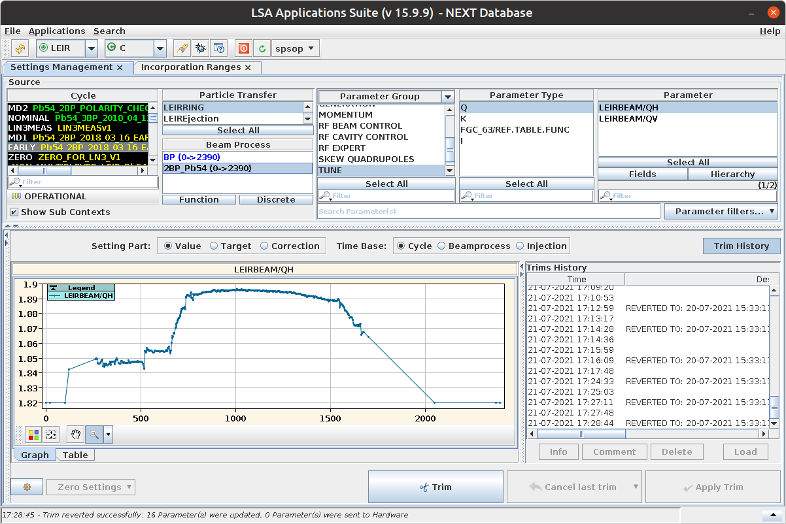
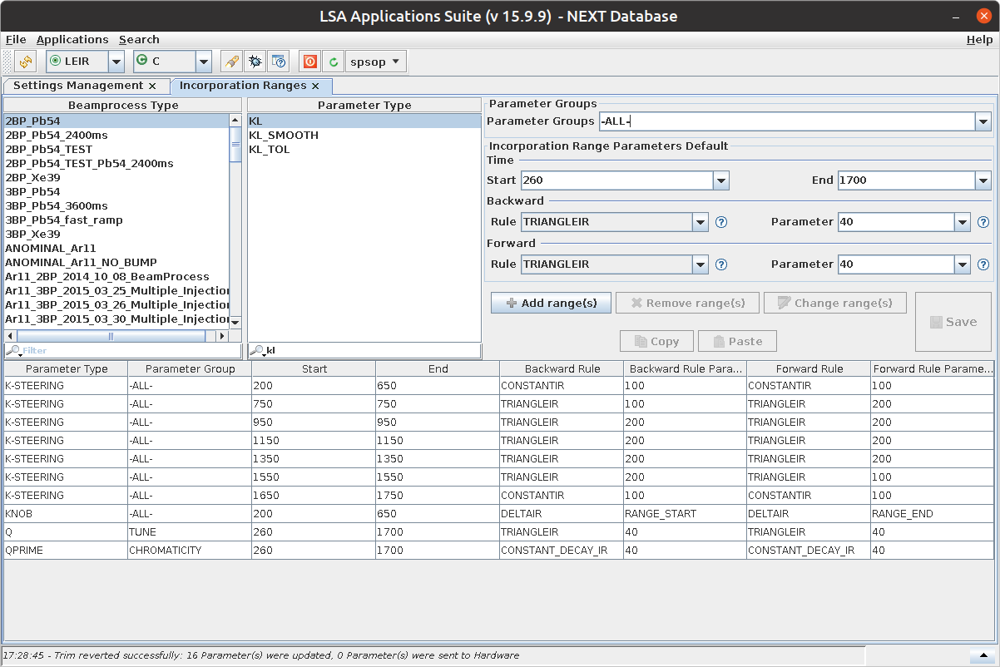
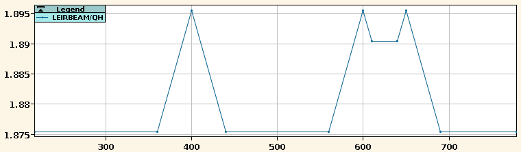

..
    SPDX-FileCopyrightText: 2020-2023 CERN
    SPDX-FileCopyrightText: 2023 GSI Helmholtzzentrum für Schwerionenforschung
    SPDX-FileNotice: All rights not expressly granted are reserved.

    SPDX-License-Identifier: GPL-3.0-or-later OR EUPL-1.2+

..
    This is a comment and as such invisible to Sphinx.
    Doctest, however, will pick it up. This way, we can verify that
    Pytest has replaced the `TrimService` with a mock object. This guarantees
    that we won't accidentally send trims to the LSA database. (Note that even
    if we did, it shouldn't be a problem, since we use LSA NEXT, not PRO.)

    >>> from cernml.lsa_utils import _services
    >>> _services.trim  # doctest: +FAIL_FAST
    <Mock spec='cern.lsa.client.TrimService' id='...'>

Communicating with the LSA Database
===================================

.. currentmodule:: cernml.lsa_utils

In the general case, full interaction with the LSA database is already
supported through the `Pjlsa`_ package. However, this package exposes the full
Java API. This gives the user full flexibility, but also makes it difficult to
solve certain common problems without writing many lines of code.

.. _pjlsa: https://gitlab.cern.ch/scripting-tools/pjlsa/

This package wraps Pjlsa and provides a simple, Pythonic wrapper that solves
80% of all use cases. It makes no claim to being complete and contributions are
welcome.

Importing an LSA-Dependent Package
----------------------------------

The `~cernml.lsa_utils` package directly imports Java packages via the JPype
import system. It does not set up the JVM for you, so you have to start the JVM
before importing the package. (In this regard, it behaves as if it were a Java
package itself.)

The cleanest way to import `~cernml.lsa_utils` is to use PJLSA's context
manager for enabling Java imports:

.. code-block:: python
    :emphasize-lines: 3-4

    >>> import pjlsa
    >>> lsa_client = pjlsa.LSAClient(server="next")
    >>> with lsa_client.java_api():
    ...     from cernml import lsa_utils
    >>> lsa_utils.get_context_by_user("SPS.USER.SFTPRO1")
    'SFT_PRO_MTE_L4780_2024_V1'

Note that the context manager only manages a change in the Python *import*
system. Once a Java package has been imported, it remains available and
functional, even outside of the context. (As long as functions or methods
inside the package don't make additional imports, of course.)

If you need Java imports enabled for a longer time, there are two options:

1. You can call a ``main()`` function inside the :keyword:`with` block.
2. You can import another module of your own inside the :keyword:`with` block
   and write your program logic in this inner module.

If none of these solutions work for you, you may also use the
`jpype:jpype.imports` module, which permanently modifies the import system:

.. code-block:: python
    :emphasize-lines: 3-4

    >>> import pjlsa
    >>> lsa_client = pjlsa.LSAClient(server="next")
    >>> import jpype.imports
    >>> # From here on, Java imports are okay.
    >>> import java.lang
    >>> import cern.lsa.client
    >>> import cernml.lsa_utils

Trimming One or Several Scalar Settings
---------------------------------------

The function `trim_scalar_settings()` provides a convenient way to trim scalar
settings in the LSA database. In the simplest case, you simply pass a mapping
of parameter name to new value and the context to be modified:

.. code-block:: python

    >>> lsa_utils.trim_scalar_settings(
    ...     {"ER.KFH31/SettingA#kickStrengthCcvA": 54.5},
    ...     context="Pb54_2BP_2021_06_09_EARLY_2400ms_V1",
    ... )

If the context is mapped to a user, you can also specify the **user** instead
of the context:

.. code-block:: python
    :emphasize-lines: 3

    >>> lsa_utils.trim_scalar_settings(
    ...     {"ER.KFH31/SettingA#kickStrengthCcvA": 54.5},
    ...     user="LEI.USER.NOMINAL",
    ... )

You can pass an additional *description* parameter to document your trim in the
trim history:

.. code-block:: python
    :emphasize-lines: 4

    >>> lsa_utils.trim_scalar_settings(
    ...     {"ER.KFH31/SettingA#kickStrengthCcvA": 54.5},
    ...     user="LEI.USER.NOMINAL",
    ...     description="Reset kick strength to known good value",
    ... )

All types of scalar settings are supported: integers, booleans and
floating-point values – both the built-in Python types and NumPy variants – are
automatically converted to Java objects. If you want to trim an enum setting,
you can pass either an integer (which denotes the enum's ordinal number), or a
string (which denotes its name):

.. code-block:: python

    >>> # Instead of "ON" and "OFF", you could also pass 1 and 0 resp.
    >>> # for this particular enum.
    >>> lsa_utils.trim_scalar_settings(
    ...     {"ER.KFH31/SettingA#kickOnA": "ON"},
    ...     user="LEI.USER.NOMINAL",
    ... )

If the mapping contains **multiple parameters**, they are changed
*transactionally*: the trim only succeeds if all settings can be applied. If
any one of them fails, the trim is rolled back and changes are applied at all.
Furthermore, the entire trim occupies only one entry in the trim history.

See also the sections on :ref:`guide/lsa_utils:Relative Trims` and
:ref:`guide/lsa_utils:Transient Trims`.

Trimming a Single Function
--------------------------

.. note::
   Before trimming a function, you must define
   :ref:`guide/lsa_utils:Incorporation Ranges` in the LSA App Suite.

Unless you want to pass an entire function object every time, trimming a
function is slightly more complicated than trimming scalar settings. There are
two ways to solve this task using `~cernml.lsa_utils`.

The simple way is by using the free function `incorporate_and_trim()`. There
are several other functions to make using it easier:

.. code-block:: python

    >>> import numpy as np
    >>> from operator import itemgetter

    >>> context = lsa_utils.get_context_by_user("SPS.USER.HIRADMT1")
    >>> context
    'HIRADMAT_PILOT_L8400_Q20_2023_V1'

    >>> xs, ys = lsa_utils.get_settings_function(
    ...     "logical.RDH.20207/K", context
    ... )
    >>> np.stack([xs, ys])
    array([[   0.,   35.,  100., 1015., 1885., 6200., 6700., 7550., 8400.],
           [   0.,    0.,    0.,    0.,    0.,    0.,    0.,   nan,   nan]])

    >>> attrs = lsa_utils.get_cycle_type_attributes(context)
    >>> for key, value in sorted(attrs.items(), key=itemgetter(1)):
    ...     if "flat top" in key:
    ...         print(key, value, sep=": ")
    VE:Intermediate flat top: 0
    VE:Start flat top: 6200

    >>> lsa_utils.incorporate_and_trim(
    ...     "logical.RDH.20207/K", context, cycle_time=1440.0, value=0.0,
    ...     relative=False,
    ...     description="Usage example of cernml.lsa_utils",
    ... )

Unlike with scalar settings, the *relative* parameter does not have a
default value. You must always specify whether you want
:ref:`guide/lsa_utils:Relative Trims` or not. :ref:`guide/lsa_utils:Transient
Trims`, on the other hand, are still the default.

The slightly more complex one is to create an `Incorporator` and call the
respective methods on it. This class avoids conversion from Python strings to
LSA objects on every function call. Thus, if you are going to make multiple
calls using the same parameter and context, this is going to be slightly more
efficient.

.. code-block:: python

    >>> inc = lsa_utils.Incorporator(
    ...     "logical.RDH.20207/K",
    ...     user="SPS.USER.HIRADMT1",
    ... )
    >>> print(inc)
    <logical.RDH.20207/K @ user='SPS.USER.HIRADMT1'>
    >>> xs, ys = inc.get_function()
    >>> np.stack([xs, ys])
    array([[   0.,   35.,  100., 1015., 1885., 6200., 6700., 7550., 8400.],
           [   0.,    0.,    0.,    0.,    0.,    0.,    0.,   nan,   nan]])
    >>>
    >>> inc.incorporate_and_trim(
    ...     1440.0, 0.0, relative=False, description="Usage example"
    ... )

Trimming Multiple Functions
---------------------------

.. note::
   As with trimming single functions, you must ensure that each function has
   its :ref:`guide/lsa_utils:Incorporation Ranges` defined *before* sending any
   trims.

The `~cernml.lsa_utils` package also allows trimming several functions with a
single trim, as long as they're modified in the same location. (This
requirement may be relaxed in the future, if necessary.) Again, there are two
ways to achieve this. The simple one is by using the same function
`incorporate_and_trim()` as for one parameter:

.. code-block:: python

    >>> lsa_utils.incorporate_and_trim(
    ...     [
    ...         "logical.MDAH.2303/K",
    ...         "logical.MDAH.2307/K",
    ...         "logical.MDAV.2301.M/K",
    ...         "logical.MDAV.2305.M/K",
    ...     ],
    ...     context="SFT_PRO_MTE_L4780_2022_V1",
    ...     cycle_time=4460.0,
    ...     value=[0.1, -0.1, 0.0, 0.05],
    ...     relative=False,
    ...     description="Usage example of cernml.lsa_utils",
    ... )

The first parameter is a list of all functions that should be changed
simultaneously, the second is the context to use. Then come the point to modify
(measured in milliseconds since the start of cycle) and the value to
incorporate. This may be anything that converts to a NumPy array of the correct
size (including a single float). The remaining parameters are the same as
before.

For a more object-oriented interface, you can use `IncorporatorGroup`:

.. code-block:: python

    >>> group = lsa_utils.IncorporatorGroup(
    ...     [
    ...         "logical.MDAH.2303/K",
    ...         "logical.MDAH.2307/K",
    ...         "logical.MDAV.2301.M/K",
    ...         "logical.MDAV.2305.M/K",
    ...     ],
    ...     user="SPS.USER.SFTPRO1",
    ... )
    >>> print(group)
    <4 parameters @ user='SPS.USER.SFTPRO1'>
    >>> # Increase all parameters by 0.1:
    >>> group.incorporate_and_trim(
    ...     4460.0, 0.1, relative=True, description="Usage example"
    ... )

The group also allows creating one `Incorporator` for each parameter
individually:

.. code-block:: python

    >>> group.get("logical.MDAH.2303/K")
    Incorporator('logical.MDAH.2303/K', context='SFT_PRO_MTE_L4780_2024_V1')
    >>> parameters = tuple(
    ...     incorporator.parameter for incorporator in group.incorporators()
    ... )
    >>> parameters == group.parameters
    True

See also the sections on :ref:`guide/lsa_utils:Relative Trims` and
:ref:`guide/lsa_utils:Transient Trims`.

Relative Trims
--------------

By default, trims sent through `~cernml.lsa_utils` are *absolute*; that means
that the value you pass is the value that is written to the database.

You can also send *relative* trims, in which the value that you pass is added
to the current value in the database. You do this by passing `True` to the
*relative* parameter of any trim function.

For example, the following call *increases* a magnet's kick strength by 0.1:

.. code-block:: python
    :emphasize-lines: 4

    >>> lsa_utils.trim_scalar_settings(
    ...     {"ER.KFH31/SettingA#kickStrengthCcvA": 0.1},
    ...     user="LEI.USER.NOMINAL",
    ...     relative=True,
    ... )

To decrease a parameter value, simply send a relative trim with a negative
value:

.. code-block:: python

    >>> lsa_utils.trim_scalar_settings(
    ...     {"ER.KFH31/SettingA#kickStrengthCcvA": -0.3},
    ...     user="LEI.USER.NOMINAL",
    ...     relative=True,
    ... )

Transient Trims
---------------

Trims that are sent through `~cernml.lsa_utils` are marked as *transient* by
default. This means that the LSA server will delete them after a while to save
bandwidth and keep the trim history manageable.

The specifics may vary, but usually, they will be deleted if they no longer
contain active or reference settings and are at least one week older than the
latest trim of the respective context.

To override this default and mark a trim as *permanent*, you can set the
*transient* parameter to `False`:

.. code-block:: python
    :emphasize-lines: 4

    >>> lsa_utils.trim_scalar_settings(
    ...     {"ER.KFH31/SettingA#kickStrengthCcvA": 54.5},
    ...     user="LEI.USER.NOMINAL",
    ...     transient=False,
    ...     description="Reset kick strength to known good value",
    ... )

Keep in mind that a meaningful description, while always important, is even
*more* important for permanent trims.

Incorporation Ranges
--------------------

In order to modify a function via Python, at least one *incorporation range*
must be defined for it. Incorporation ranges define how a modification of the
function is incorporated into its overall shape and serve to preserve certain
properties of continuity, flatness, etc.

Incorporation ranges are defined for each beam process, parameter and
(optionally) parameter group. One simple way to figure out the beam processes
for a given context by hand, you can open the LSA App Suite, start settings
management, select the desired context and enable "Show Sub Contexts".

Creating Incorporation Ranges
+++++++++++++++++++++++++++++

To create an incorporation range, you stay within the LSA App Suite and start
the Incorporation Ranges app under the category "Contexts". There, you can pick
the beam process, parameter and parameter group. If a rule should apply to
multiple similar parameters, you can set the parameter group to "all".

Each incorporation range has a *start* and *end* as well as a *forward rule*
and a *backward rule*. The *start* and *end* determine the time interval within
the beam process for which the range is valid. They're measured in milliseconds
from the start of the beam process. By clicking the drop-down button, you can
also enter special constants that refer to the start and end of the entire beam
process.

It is not possible to define incorporation ranges that span multiple beam
processes. It is also not *advisable* to modify a function close to the start
or the end of the beam process. Generally, the incorporation rules will only be
applied up to the beam process edge linear interpolation will occur up to the
closest point in the next beam process, wherever that point may be.

The forward and backward rules define how a modification at a single point is
propagated into the range. Most rules take an additional time parameter.
Generally, they define how smoothly a change is incorporated. As for *start*
and *end*, the parameter may be set to certain constants such as "start of beam
process" or "start of incorporation range".

List of Incorporation Rules
+++++++++++++++++++++++++++

The most important rules are given below. In the app, you can also click the
question mark icon to get more help on how they work.

``CONSTANTIR``
    All points in the current beam process are set to the same value. This
    ignores the rule parameter as well as the length of the incorporation range
    (except to check whether the rule may be applied at all).

``DELTAIR``
    The selected point is set to the desired value. In addition, an interval
    whose length is given by the rule parameter is raised or lowered by the
    same amount. The shape of the function within this interval is preserved.
    Note that this interval is unrelated to the incorporation range. Outside of
    this interval, no further continuity constraints are applied  – the
    function is simply linearly interpolated to the next point, wherever that
    may be.

``CONSTANT_DECAY_IR``
    The selected point is set to the desired value. In the interval whose
    length is given by the rule parameter, the delta that was necessary to
    achieve this change is linearly decreased to zero. The shape of the
    function within this interval is honored.

``TRIANGLEIR``
    The selected point is set to the desired value. The function is linearly
    interpolated over an interval whose length is given by the rule parameter.
    The function is flattened over the given interval. This is the main
    difference between this rule and ``CONSTANT_DECAY_IR``.

Note that the incorporation range has no effect on how these rules behave; it
only determines the time interval for which they are valid. For example, you
can declare an incorporation range from 400 to 700 ms where both rules are
``CONSTANT_DECAY_IR`` with a parameter of 40 ms. In this case:

1. Incorporating a change at 400 ms will modify the function in the interval
   from 360 to 440 ms by linearly decreasing the delta to zero.
2. Incorporating a change at 600 ms will modify the interval from 560 to 640
   ms. This does not overlap with the previous change, but uses the same rule
   and leads to the same triangular shape.
3. Incorporating a change at 650 ms will overlap with cause an overlap with the
   previous interval. This will honor the previously falling slop, but add its
   own changes on top.
4. An attempt to incorporate a change at 710 ms will fail, as it is outside of
   the incorporation range.

Global Trim Request Hooks
-------------------------

Unfortunately, LSA comes with a lot of global state. Sometimes you want to
modify this state without plugins such as optimization problems being aware of
that. Until a better architecture is found, this will be done through global
hooks.

For example, it is desirable for a *host application* to influence the trim
description sent by optimization problems – e.g. to add the host name and
version to make the trim history more understandable. Another use case is to
make trims :ref:`transient or permanent <guide/lsa_utils:transient trims>`
depending on conditions in the app that the plugin cannot (and should not) know
about.

To afford these use cases, this package defines certain *trim request hooks*.
These hooks are able to modify the *transient* flag and the trim *description*
nearly arbitrarily. They are called by all functions of this package that send
a trim request to the LSA database:

- `Incorporator.incorporate_and_trim()`,
- `IncorporatorGroup.incorporate_and_trim()`,
- `incorporate_and_trim()`,
- `trim_scalar_settings()`.

Implementing Trim Request Hooks
+++++++++++++++++++++++++++++++

To implement a new trim request hook, subclass the :term:`abstract base class`
`Hooks`:

.. code-block:: python
   :emphasize-lines: 6

    >>> from typing import Optional
    >>> from cernml import lsa_utils
    >>> class ForcefulHooks(lsa_utils.Hooks):
    ...     def trim_description(self, desc: Optional[str]) -> str:
    ...         if not desc:
    ...             return "via my-app v1.0"
    ...         desc = super().trim_description(desc)
    ...         return f"{desc} (via my-app v1.0)"
    ...     def trim_transient(self, transient: Optional[bool]) -> bool:
    ...         warnings.warn(f"Ignoring transient flag: {transient}")
    ...         return True

The above hook will inspect the *description* and the *transient* arguments
passed by every call to a trim function. Empty (or missing) descriptions are
replaced with the name of the host application; non-empty descriptions are
suffixed with it. The *transient* flag, on the other hand, is always ignored
and replaced with `True`.

The `super` call in the highlighted line deserves special attention: It calls
the base implementation of the method, which will automatically forward the
call to the previous hook. This ensures that you can always fall back to the
default behavior.

Becase the default behavior of the hook methods is to forward all calls to the
previous hook, you only need to implement the methods that you're interested
in.

Installing Trim Request Hooks
+++++++++++++++++++++++++++++

Implementing a `Hooks` subclass does not automatically *install* your hooks. To
do that, you need to call `Hooks.install_globally()`:

    >>> hooks = ForcefulHooks()
    >>> hooks.install_globally()
    >>> lsa_utils.get_current_hooks() is hooks
    True
    >>> hooks.uninstall_globally()
    >>> lsa_utils.get_current_hooks() is hooks
    False

As you can see, `Hooks.uninstall_globally()` does the opposite: it removes your
hooks and replaces them with whatever hooks came previously.

To ensure that you don't forget to uninstall your trim request hooks, you can
also use them as a context manager:

    >>> with ForcefulHooks() as hooks:
    ...     lsa_utils.get_current_hooks() is hooks
    True
    >>> lsa_utils.get_current_hooks() is hooks
    False

Because installing a hook preserves the previous hook, they can be nested as
deep as necessary:

    >>> with hooks:
    ...     assert lsa_utils.get_current_hooks() is hooks
    ...     with lsa_utils.Hooks() as no_op_hooks:
    ...         assert lsa_utils.get_current_hooks() is no_op_hooks
    ...     assert lsa_utils.get_current_hooks() is hooks

Note that you should uninstall hooks in the reverse order of installation. Not
doing so will give you a warning:

    >>> import pytest
    >>> hooks.install_globally()
    >>> no_op_hooks.install_globally()
    >>> with pytest.warns() as record:
    ...     hooks.uninstall_globally()  # Oops! Forgot to uninstall no_op_hooks
    >>> warning = record.pop()
    >>> raise warning.category(warning.message)
    Traceback (most recent call last):
    ...
    InconsistentHookInstalls: current hook is <...>, but expected <...>
