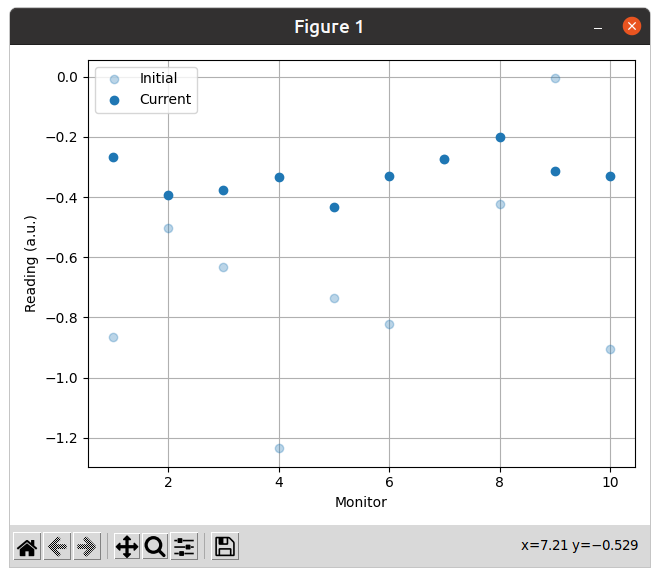

Keeping Rendering Logic Concise
===============================

Motivation
----------

The render mode `"matplotlib_figures" <coi:cernml.coi.Problem.render>` makes it
possible to create `mpl:matplotlib` plots and have the host application embed
them. Because optimization problems change on each iteration, these plots need
to be updated regularly. Doing this correctly without paying the cost of
clearing and completely redrawing the plot each time is complicated. This
complexity tends to hide the basic logic that you might wish to express when
creating a plot.

In addition, the render mode `"human" <coi:cernml.coi.Problem.render>` also
often uses Matplotlib, but in an interactive environment. Supporting both
render modes while writing the plotting logic only once again is tricky to get
right.

The `~cernml.mpl_utils.FigureRenderer` class provides an interface that
separates plot *initialization* from plot *updating*. In addition, it contains
logic to abstract away the difference between the two render modes. Once you
hold a `~cernml.mpl_utils.FigureRenderer` in your hand, the implementation of
:meth:`~cernml.coi.Problem.render()` becomes trivial:

.. code-block:: python
    :emphasize-lines: 20

    from cernml.mpl_utils import FigureRenderer
    from cernml.coi import SingleOptimizable

    class MyProblem(SingleOptimizable):
        metadata = {
            "render.modes": ["human", "ansi", "matplotlib_figures"],
        }

        def __init__(self):
            self._renderer: FigureRenderer = ...
            ...

        def render(self, mode="str"):
            if mode in ["human", "matplotlib_figures"]:
                # This automatically creates the right kind of figure and
                # calls its internal (abstract) methods to fill it with
                # graphs. The return value adapts to the render mode.
                return self._renderer.update(mode)
            if mode == "ansi":
                return ...
            return super().render(mode)

        ...

Generators
----------

While you can implement the interface of `~cernml.mpl_utils.FigureRenderer`
yourself (and that may make sense in particularly complicated cases), most
cases are extremely simple: you create a plot once, then repeatedly update it
with new data. For this case, :term:`generators <generator>` are particularly
well suited. Generators are like regular functions, but contain
:keyword:`yield` instead of :keyword:`return`.

Whenever a generator hits a yield point, it suspends execution and returns to
the caller. When the caller later resumes the generator, it continues execution
from the previous yield point. This makes it easy to express the init–update
pattern.

Example
-------

The following example uses `~cernml.mpl_utils.make_renderer()` to convert a
:term:`generator` into a concrete `~cernml.mpl_utils.FigureRenderer`. The
renderer creates a figure with a single `~mpl:matplotlib.axes.Axes` and two
graphs:

1. the readings at the start of optimization;
2. the current readings.

It also contains a few `print` calls to show the control flow. In production
code, you would usually create a module-scope logger, as explained in `this
Acc-Py tutorial`_.

.. _`this Acc-Py tutorial`: https://wikis.cern.ch/display/ACCPY/Logging#Logging-Configuringaloggerinlibrarycode

.. code-block:: python
    :emphasize-lines: 15,33,77

    >>> import numpy as np
    >>> from cernml import coi
    >>> from cernml.mpl_utils import make_renderer
    >>> from gym.spaces import Box
    >>>
    >>> class MyProblem(coi.SingleOptimizable):
    ...     metadata = {
    ...         "render.modes": ["human", "matplotlib_figures"],
    ...         "cern.machine": coi.Machine.NO_MACHINE,
    ...     }
    ...     optimization_space = Box(-1.0, 1.0, shape=(4,))
    ...
    ...     def __init__(self):
    ...         self._last_readings = None
    ...         self._renderer = make_renderer(self._iter_updates)
    ...         self.response = np.random.uniform(size=(10, 4))
    ...
    ...     def get_initial_params(self):
    ...         print("get_initial_params()")
    ...         self._last_readings = None
    ...         return self.optimization_space.sample()
    ...
    ...     def compute_single_objective(self, params):
    ...         print("compute_single_objective()")
    ...         # The `@` operator performs matrix multiplication in Python.
    ...         self._last_readings = self.response @ params
    ...         loss = np.sqrt(np.mean(np.square(self._last_readings)))
    ...         return loss
    ...
    ...     def render(self, mode="human"):
    ...         # As before.
    ...         if mode in self.metadata["render.modes"]:
    ...             return self._renderer.update(mode)
    ...         return super().render(mode)
    ...
    ...     # This is a generator. It contains `yield` instead of `return`.
    ...     def _iter_updates(self, figure):
    ...         print("initializing the figure")
    ...         # This part is executed on the very first call to `render()`.
    ...         # This might happen before or after `compute_single_objective()`,
    ...         # so `self._last_readings` might still be None.
    ...         axes = figure.subplots()
    ...         axes.set_xlabel("Monitor")
    ...         axes.set_ylabel("Reading (a.u.)")
    ...         axes.grid()
    ...         # Both graphs start out empty. We fill them later.
    ...         initial, = axes.plot([], "o", alpha=0.3, label="Initial")
    ...         current, = axes.plot([], "o", color="tab:blue", label="Current")
    ...         axes.legend(loc="best")
    ...         # This is our update loop.
    ...         while True:
    ...             if self._last_readings is None:
    ...                 # First call after `get_initial_params()`.
    ...                 # We don't have any data yet.
    ...                 print("render(no data)")
    ...                 initial.set_data([], [])
    ...                 current.set_data([], [])
    ...             elif len(initial.get_ydata()) == 0:
    ...                 # First call with data. We need to update
    ...                 # both graphs and adjust axes limits.
    ...                 print("render(reset initial)")
    ...                 ydata = self._last_readings
    ...                 xdata = np.arange(1, 1 + len(ydata))
    ...                 initial.set_data(xdata, ydata)
    ...                 current.set_data(xdata, ydata)
    ...                 axes.relim()           # Recalculate data bounding box.
    ...                 axes.autoscale_view()  # Adjust axes limits.
    ...                 figure.tight_layout()  # Adjust margins around axes.
    ...             else:
    ...                 # Any future call. Only update `current`.
    ...                 # Don't adjust axes limits to avoid "jumping".
    ...                 print("render(update current)")
    ...                 current.set_ydata(self._last_readings)
    ...             # Yield statement. This is where we return `render()`.
    ...             # Next time `render()` calls us, we will continue here
    ...             # and loop around to `while True`.
    ...             yield

The following program shows the order in which these functions call each other:

.. code-block:: python

    >>> problem = MyProblem()
    >>> x0 = problem.get_initial_params()
    get_initial_params()
    >>> fig = problem.render("matplotlib_figures")
    initializing the figure
    render(no data)
    >>> for i in range(1, 4):
    ...     print(f"iteration #{i}")
    ...     x = problem.optimization_space.sample()
    ...     loss = problem.compute_single_objective(x)
    ...     fig = problem.render("matplotlib_figures")
    iteration #1
    compute_single_objective()
    render(reset initial)
    iteration #2
    compute_single_objective()
    render(update current)
    iteration #3
    compute_single_objective()
    render(update current)
    >>> # Start from scratch, to show that it works.
    >>> x0 = problem.get_initial_params()
    get_initial_params()
    >>> fig = problem.render("matplotlib_figures")
    render(no data)
    >>> loss = problem.compute_single_objective(x0)
    compute_single_objective()
    >>> fig = problem.render("matplotlib_figures")
    render(reset initial)

And this is what the plot could look like after a few iterations:

